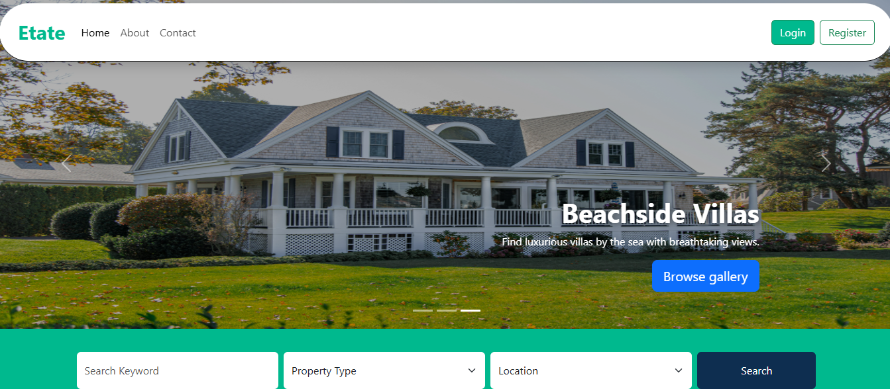
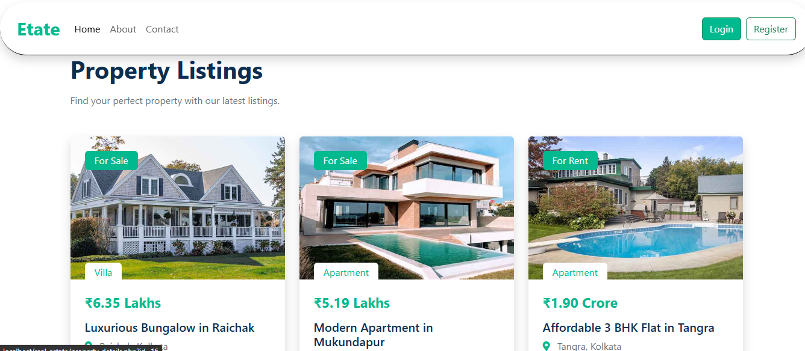
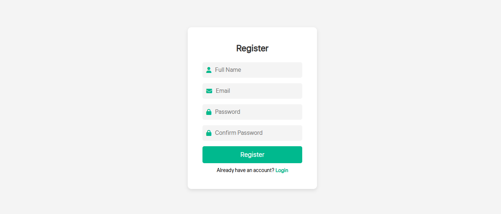
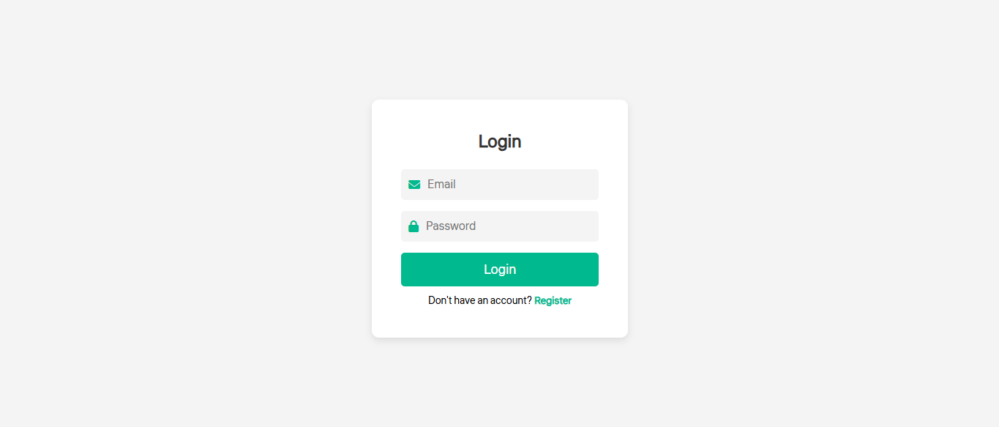
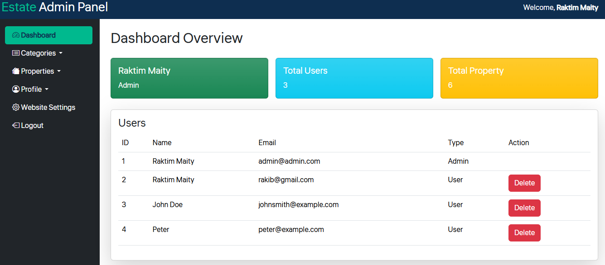

# Real Estate Website

A fully functional real estate platform for listing, managing, and searching properties. This project features both admin and user panels for seamless property management and browsing.

## 🚀 Features


### 🛠️ Admin Features
- Dashboard to manage properties and categories
- Add, update, and delete property listings
- Manage categories (Apartment, Villa, Office, etc.)
- Secure admin login with hashed passwords
- Password update functionality

### 📊 Additional Features
- Multi-level dropdown sidebar menu with active link highlights
- Mobile-responsive design with Bootstrap 5
- Login to admin panel Admin Id: `admin@admin.com`
- Login to admin panel Admin Password: `nopass`

---

## 🏗️ Tech Stack

| Technology | Usage |
|------------|--------|
| **Frontend** | HTML, CSS, JavaScript |
| **Libraries** | Bootstrap 5|
| **Backend** | PHP |
| **Database** | MySQL |

---

### Database Structure
#### Tables

1. **`admin`**
   - `id` (Primary Key)
   - `name`
   - `email` (Unique)
   - `password` (Hashed)
   - `type` (1 for Admin, 0 for User)

2. **`categories`**
   - `id` (Primary Key)
   - `name` (e.g., Apartment, Villa, Office)
   - `description` (for describe the category)

3. **`properties`**
   - `id` (Primary Key)
   - `title`
   - `description`
   - `price`
   - `location`
   - `category_id` (Foreign Key → `categories.id`)
   - `image`
   - `size` (e.g., sq. ft.)
   - `bedrooms`
   - `bathrooms`
   - `status` (For Rent, For Sale)

4. **`website`**
   - `id` (Primary Key)
   - `website_name` 
   - `website_title` 
   - `website_owner` 
---

## 🔌 Installation

1. **Clone the repository:**
   ```bash
   git clone https://github.com/yourusername/real-estate.git
   cd real-estate

2. **Database configuration**
    - first open XAMPP control panel,
    - Then turn on MySQL and Apache server,
    - Then open in the browser
    ```sh
    localhost/phpmyadmin
    ```
    - After that create a database 
    ```sh
    estate
    ```
    - After that import the `estate.sql` file on the database
    - Then go to new tab in the browser and type the URL
    ```sh
    localhost/real-estate
    ```
    - Then go to the admin login URL
    ```sh
    localhost/real-estat/admin
    ```
    - Then Enter the admin id and password for login to the admin panel. Admin id and password is:
    <br>
    Admin id: admin@admin.com
    <br>
    password: nonpass
    <br>
    - N.B.: Admin can change or update his/her email id or password from profile and security section.

---
## Screenshots
1. Landing Page


2. Dynamic Properties List


3. Registration Page


4. Login Page


5. Admin Dashboard


---

## 📊 Future Enhancements

✅ **User Dashboard** – Provide a responsive user dashboard.  
✅ **Contact Messages** – Connect user with admin through contact section.  

---
## 👨‍💻 Developer Contact
 * 👤 Raktim Maity
 * 📧 Email: reach.ratimmaity.com
 * 🌐 Website: https://raktimmaity.free.nf
 * 🔗 GitHub: [github.com/Raktimmaity](https://github.com/Raktimmaity/)
 * 📌 LinkedIn: https://www.linkedin.com/in/raktim-maity-0a558824a/
